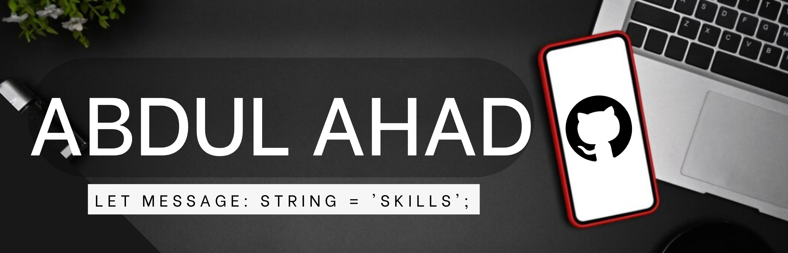

<h1 align="left">Hi there, This is <a href= "https://www.linkedin.com/in/abdul-a-53b146129" target="_blank" rel="noopener noreferrer">Abdul Ahad</a> </h1>
  

<h2>Let's Connect..!   </h2>

 

<ul>
  <li>
  
  <li>
     
    
  <li>
     
    

## <b> Skills</b>
 
<picture></picture> **About me**

